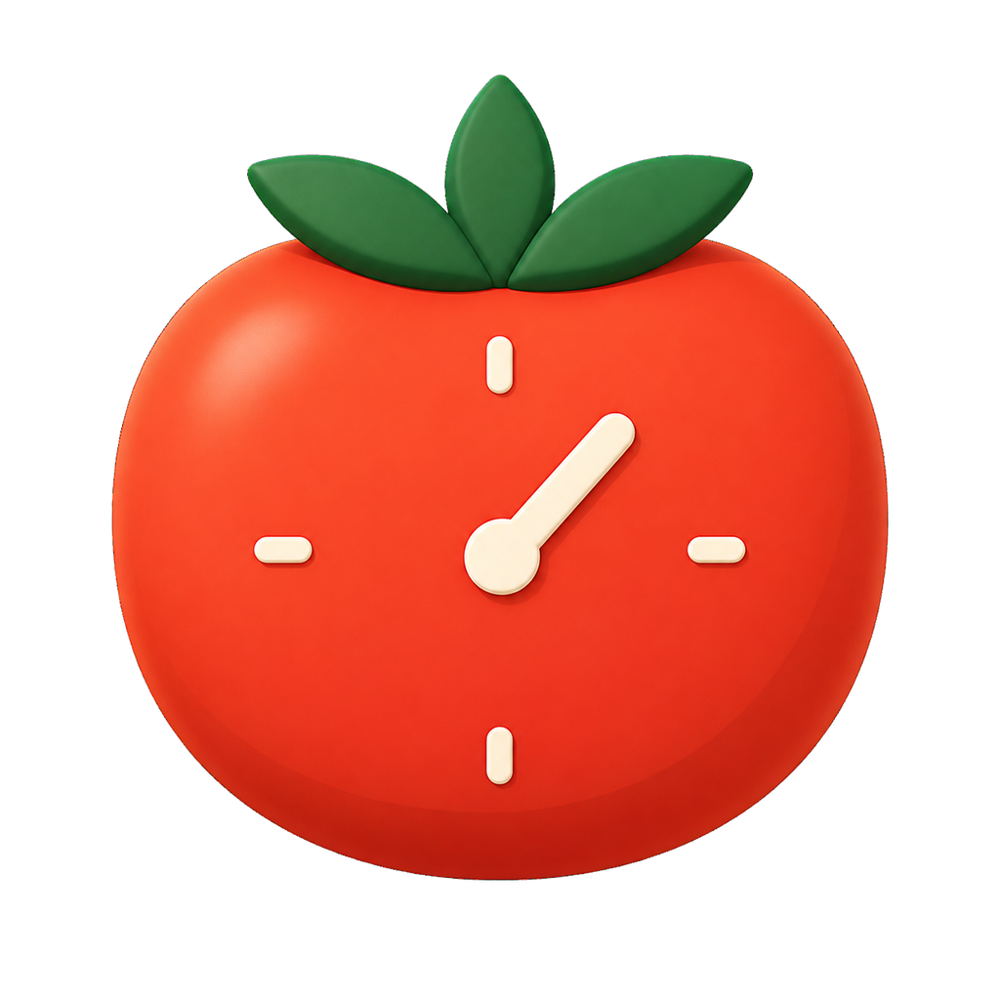

<p align="center">
  
</p>

# Pomodoro Tracker / 番茄事项

[English](#english) · [简体中文](#简体中文)

## English

Pomodoro Tracker is a local-first focus tracker for desktop and Android. It combines a Pomodoro
timer, hierarchical tasks, Markdown session notes, dashboards, natural ambient sounds, and focus
history in one application. The desktop edition uses Electron; the Android edition uses Capacitor.

### Highlights

- Organize tasks and sub-tasks at any depth, such as `CS → AI → CS188 → Homework 3`.
- Use global timer defaults or custom focus and break durations for individual tasks.
- Record completed and interrupted sessions with precise dates, times, and durations.
- Add and edit Markdown notes during a focus session or when it finishes.
- Explore day, week, and year dashboards with hierarchical task statistics.
- Search task names and session notes, including regular expressions and date ranges.
- Mix gapless natural ambient sounds while focusing.
- Switch between English and Simplified Chinese at any time.
- Keep all task data and focus history in a local SQLite database.

### Downloads

GitHub Releases provide the following packages:

- Windows x64 NSIS installer
- Windows x86 (32-bit) NSIS installer
- Linux x64 AppImage
- macOS Intel x64 DMG
- macOS Apple Silicon arm64 DMG
- Android APK (Android 7.0 or newer)

The Windows installer supports English and Simplified Chinese and defaults to English. The
application is currently unsigned, so Windows may show a SmartScreen warning.

### User guide

#### 1. Install and complete the first setup

1. Download the package for your system from GitHub Releases.
2. On Windows, run the x64 installer on most modern computers. Use x86 only for a 32-bit Windows
   installation. Choose English or Simplified Chinese in the installer and select an installation
   directory.
3. On Linux, make the AppImage executable with `chmod +x Pomodoro*.AppImage`, then run it. If the
   distribution does not support AppImage out of the box, install its FUSE compatibility package
   or extract the image with `--appimage-extract`.
4. On macOS, download the DMG that matches the processor, open it, and drag Pomodoro Tracker into
   Applications. Choose Apple Silicon for M1 and newer Macs; choose Intel for older Intel Macs.
   Because the current package is not notarized, the first launch may require Control-clicking the
   application and choosing **Open**.
5. On Android, allow notifications when prompted so timer completion remains visible while the
   application is in the background. Android 7.0 (API 24) or newer is required.
6. Open **File → Settings**. Confirm the default focus and break duration, the first day of the
   week, mini timer behavior, completion sounds, and database location.

The interface language selected by the Windows installer is used on first launch. You can change
it later under **Settings → General** without restarting the application.

#### 2. Organize tasks

- Use the group button in the task toolbar to create top-level groups such as Work, Study, or
  Personal. A group organizes data and dashboards but cannot be timed directly.
- Use the add icon on a group to create a top-level task. Use the add-child icon on any task to
  create a nested task.
- Double-click a task row to expand or collapse its children. The arrow remains available for the
  same operation.
- Use the pencil icon to rename a group or task. Sibling task names must be unique; group names
  must also be unique.
- Use the up/down controls or drag and drop to reorder and move tasks. A task carries its complete
  subtree when moved.
- Marking a parent complete also completes unfinished descendants. Reopening a child automatically
  reopens its completed ancestors. Completed items move below active siblings and keep only the
  completion and history actions visible.
- The task-name search keeps the matching task, its parent path, and its descendants visible so
  that the result remains understandable in context.

#### 3. Start and control a Pomodoro

1. Click either the tomato icon or its `25/5` duration label to select the task and start a focus
   session.
2. Use the timer-settings icon beside a task to override the global focus and break duration for
   that task. The displayed `40/10`, for example, means 40 minutes of focus and a 10-minute break.
3. Open the mini timer when you want a compact always-on-top display. Drag it from any empty area;
   its position is restored the next time it opens. Double-click it to return to the main window.
4. While timing, use **Quick note** to capture ideas. The draft is merged into the final session
   note instead of opening a competing record.
5. When focus finishes, the main window is activated, the completion sound plays, and a session
   note editor opens. The completed session is already stored before the break begins.
6. Interrupting focus after 30 seconds records elapsed time but does not increment the completed
   Pomodoro count. Sessions shorter than 30 seconds are discarded immediately. Interrupting a
   break does not remove the Pomodoro that was completed before it.

A running Pomodoro is locked to its current task. Clicking another task shows an explanation
instead of silently switching the active session.

#### 4. Write session notes with Markdown

The note editor is available during focus, after focus completes, and from focus history. It shows
the session date, start/end time, and actual duration. Supported Markdown includes:

- headings: `## Heading`
- bold and italic: `**important**`, `*detail*`
- lists: `- item` and `1. step`
- quotes and inline code: `> summary`, `` `code` ``
- links and strikethrough: `[label](https://example.com)`, `~~obsolete~~`

Use the built-in Markdown help beside the editor for a compact reference. Notes are rendered in
focus history but remain editable.

#### 5. Review and search history

- Click the history icon on any active or completed task to open its records. A parent task's
  history includes every descendant.
- Records are grouped by date and show start/end time, duration, completion state, and note in two
  aligned columns.
- Use the history search to limit results to the current task tree. Use the toolbar record-search
  button to search all tasks.
- Both searches support plain text, case sensitivity, regular expressions, and optional start/end
  dates. Leaving both dates blank searches all time.
- A result's jump button opens the corresponding top-level history view and scrolls directly to
  that session; use the back button to return to the previous results.

#### 6. Use the dashboard

- **Day** shows task allocation and focus time in four-hour intervals.
- **Week** uses the configured first day of the week and compares all seven days.
- **Year** aggregates actual focus time by month.
- Choose a date for any period or return to the current date with one click.
- Change **Visible depth** to aggregate only top-level groups or reveal deeper task levels. Child
  segments remain visually contained inside their parent segment.
- Hover the chart or legend to highlight related data. Parent totals always include descendants.

#### 7. Configure sound, display, and data

- **General:** switch language and adjust interface scaling. Shortcuts are `Ctrl++`, `Ctrl+-`, and
  `Ctrl+0`.
- **Timer:** set default durations and whether the mini timer stays above other windows.
- **Sound:** choose focus/break completion audio and mix rain, stream, wind, thunderstorm,
  fireplace, ocean waves, forest birds, night crickets, or waterfall ambience. Nature sounds
  play only during focus and fade out for breaks.
- **Data:** configure the first day of the week or select an existing SQLite database. Selecting an
  existing file opens that database; it does not overwrite it.
- **Offline database sync:** Android can export its local tasks and focus history as a desktop-
  compatible `.sqlite3` file. Android can import a desktop database by replacing local data or
  merging it. Desktop can merge another Pomodoro database without changing its configured
  database location.

During a merge, tasks with the same hierarchy and name are combined and identical sessions are
skipped. If two non-identical sessions overlap in time, the app shows the conflict before writing
and asks whether the local or imported record should be kept.

For backups, close the app and copy `pomodoro.sqlite3` to a safe location. To move between
computers, copy that file and select it from **Settings → Data**. Keep a backup before replacing or
editing a database manually.

Android keeps its working data in private on-device storage. Use **Settings → Data → Export
database** to save or share a backup before uninstalling the app. Use **Import database** to merge a
desktop/mobile backup or replace the current phone data.

#### Troubleshooting

- **Electron did not install:** delete only `node_modules/electron`, then run `npm install` again.
  Network or TLS errors during this step mean the Electron runtime download was interrupted.
- **Native module build failure:** install Visual Studio Build Tools with the Desktop development
  with C++ workload, or use a Node/Electron combination with a compatible prebuilt binary.
- **No sound on Linux:** verify that Chromium/Electron is visible in the desktop audio mixer and
  that PipeWire or PulseAudio has an active output device.
- **AppImage does not start:** install the distribution's FUSE compatibility package, or run the
  AppImage with `--appimage-extract` and start `squashfs-root/AppRun`.
- **Windows SmartScreen warning:** the package is not code-signed yet. Verify that it came from this
  repository's GitHub Release before choosing to run it.
- **macOS says the developer cannot be verified:** the DMG is currently unsigned and not notarized.
  Verify that it came from this repository, then Control-click the app in Applications and choose
  **Open**. A public release should eventually use Apple Developer ID signing and notarization.

### Run from source

Requirements: Node.js 22 or newer, npm, and native build tools when a prebuilt
`better-sqlite3` binary is unavailable.

```powershell
npm install
npm start
```

Quality checks:

```powershell
npm run check
npm test
```

### Build packages

Build Windows packages on Windows:

```powershell
npm ci
npm run dist:win:x64
npm run dist:win:ia32
```

Build an Android debug APK after installing Android Studio/JDK 21 and configuring the Android SDK:

```powershell
npm ci
npm run android:apk
```

The APK is written under `android/app/build/outputs/apk/debug/`. `npm run android:sync` refreshes
the native project after changes to the shared renderer.

Build the AppImage on an x64 Linux host:

```bash
npm ci
npm run dist:linux
chmod +x dist/*.AppImage
```

Build a macOS DMG on a Mac. Use the command matching the processor architecture:

```bash
npm ci
npm run dist:mac:arm64 # Apple Silicon
npm run dist:mac:x64   # Intel
```

The unsigned DMG is written to `dist/`. Publishing without a Gatekeeper warning requires an Apple
Developer ID certificate and Apple notarization credentials.

Because the project uses the native `better-sqlite3` module, build each package on its target
operating system instead of cross-compiling it from another platform.

### Continuous delivery

The `Build and release installers` GitHub Actions workflow runs formatting, lint, and tests, then
builds Windows x64, Windows x86, Linux x64 AppImage, macOS Intel DMG, and macOS Apple Silicon DMG
artifacts:

- pushes and pull requests targeting `main` build downloadable workflow artifacts;
- tags matching `v*` also publish every desktop package and the Android APK to a GitHub Release;
- the workflow can be started manually from the Actions page.

To publish a release, update the version when needed and push a tag such as `v0.1.0`.

### Architecture and data

- `src/main`: Electron main process, SQLite access, native windows, and IPC.
- `src/preload`: minimal renderer API bridge.
- `src/renderer`: interface, timer, charts, audio, and interactions.
- `test`: automated tests using Node.js's built-in test runner.
- `docs/internationalization.md`: English and Chinese interface contribution rules.

The database is stored under Electron's `userData` directory. On Windows it is normally located
at `%APPDATA%/pomodoro-tracker/pomodoro.sqlite3`. Foreign keys and WAL mode are enabled. Deleting
a parent task cascades to its descendants and related focus records.

---

## 简体中文

番茄事项是一款支持桌面与 Android 的本地优先专注管理工具，支持任意层级的事项结构，并将番茄钟、专注历史、Markdown 事项记录、数据看板和自然环境声整合在一个应用中。桌面版使用 Electron，Android 版使用 Capacitor。

### 主要功能

- 以任意深度组织事项和子事项，例如 `CS → AI → CS188 → Homework 3`。
- 使用全局默认时间，或为特定事项设置独立的专注与休息时长。
- 记录完整和被打断的专注，包括具体日期、起止时间与实际时长。
- 在专注过程中或结束后填写、修改支持 Markdown 的事项记录。
- 通过日、周、年看板查看包含父子层级关系的统计数据。
- 按名称搜索事项，并通过正则表达式和日期范围搜索事项记录。
- 在专注过程中混合播放无缝衔接的自然环境声。
- 随时切换英文和简体中文界面。
- 所有事项和专注历史均保存在本地 SQLite 数据库中。

### 下载安装

GitHub Releases 提供以下安装文件：

- Windows x64 NSIS 安装程序
- Windows x86（32 位）NSIS 安装程序
- Linux x64 AppImage
- macOS Intel x64 DMG
- macOS Apple Silicon arm64 DMG
- Android APK（Android 7.0 或更高版本）

Windows 安装程序支持英文和简体中文，并默认选择英文。应用目前没有代码签名，因此 Windows 可能显示 SmartScreen 提示。

### 使用说明

#### 1. 安装与首次设置

1. 从 GitHub Releases 下载与系统对应的安装包。
2. 绝大多数现代 Windows 电脑应使用 x64 安装包；只有 32 位 Windows 才使用 x86。运行安装程序后选择英文或简体中文，并指定安装目录。
3. Linux 用户先执行 `chmod +x Pomodoro*.AppImage`，然后运行 AppImage。如果发行版默认不支持 AppImage，请安装 FUSE 兼容包，或使用 `--appimage-extract` 解压运行。
4. macOS 用户请根据处理器下载对应 DMG：M1 及更新机型使用 Apple Silicon 版，旧款 Intel Mac 使用 Intel 版。打开 DMG 后将番茄事项拖入“应用程序”。当前安装包尚未公证，首次运行可能需要按住 Control 点击应用并选择“打开”。
5. Android 首次运行时请允许通知权限，以便应用进入后台后仍能显示计时结束提醒。最低支持 Android 7.0（API 24）。
6. 打开 **文件 → 设置**，确认默认专注/休息时长、每周起始日、计时小窗、结束提示音和数据库位置。

Windows 安装器中选择的语言会用于软件首次启动，之后可在 **设置 → 常规** 中即时切换，无需重启。

#### 2. 组织事项

- 使用事项工具栏中的分组按钮创建工作、学习或生活等顶层分组。分组会参与数据库和看板统计，但不能单独计时。
- 点击分组上的添加图标创建一级事项；点击任意事项上的添加子项图标，可以继续建立任意深度的层级。
- 双击事项行可以展开或折叠子项，原有的折叠箭头仍然可用。
- 使用铅笔图标重命名分组或事项。同一分组中的一级事项不能重名，同一个父事项的直接子项也不能重名。
- 使用上下移动按钮或拖放调整顺序和层级；移动父事项时，其完整子树会一起移动。
- 将父事项标记完成时，会同步完成其下未完成的子项；重新打开子项时，会自动把已经完成的父级恢复为未完成。已完成事项移动到同级底部，只保留完成状态和专注历史按钮。
- 事项名称搜索会同时保留命中事项的父级路径和全部子项，保证搜索结果仍然具有完整上下文。

#### 3. 开始和控制番茄钟

1. 点击番茄图标或其下方的 `25/5` 时间，都可以选择该事项并开始专注。
2. 点击事项旁的计时设置图标，可以覆盖全局默认时长。例如 `40/10` 表示专注 40 分钟、休息 10 分钟。
3. 需要紧凑显示时可打开计时小窗。小窗空白区域可拖动，关闭位置会被记住；双击小窗可返回主程序。
4. 专注过程中可通过 **随手记** 记录临时想法。草稿会合并到最终事项记录中，不会与结束时的记录弹窗冲突。
5. 专注完成后会播放提示音、激活主窗口并打开事项记录编辑器；完整番茄会在进入休息前写入数据库。
6. 专注超过 30 秒后打断，会记录实际时长但不增加完整番茄次数；不足 30 秒会立即结束且不写入数据库。打断休息不会删除此前已经完成的番茄次数。

番茄钟运行时会锁定当前事项。点击其它事项只会显示原因说明，不会悄悄切换正在进行的计时。

#### 4. 使用 Markdown 编写事项记录

专注过程中、专注结束后以及专注历史中都可以打开记录编辑器。编辑器会显示本次番茄的日期、起止时间和实际时长。当前支持：

- 标题：`## 标题`
- 粗体和斜体：`**重点**`、`*补充*`
- 列表：`- 清单项`、`1. 步骤`
- 引用和行内代码：`> 摘要`、`` `代码` ``
- 链接和删除线：`[名称](https://example.com)`、`~~废弃~~`

编辑器旁会直接显示 Markdown 帮助。事项记录在历史界面中以排版后的形式显示，并且之后仍可修改。

#### 5. 查看与搜索专注历史

- 点击任意未完成或已完成事项的历史图标，可以查看该事项的全部记录；父事项会包含所有后代事项的历史。
- 记录按日期折叠分组，并以两列形式显示起止时间、实际时长、完成状态和事项记录。
- 历史界面的搜索只检索当前事项树；主工具栏中的记录搜索则检索全部事项。
- 两种搜索都支持普通文本、区分大小写、正则表达式以及可选的开始/结束日期。日期全部留空时默认搜索所有时间。
- 点击搜索结果的跳转按钮，会打开对应一级事项的完整历史并定位到该记录；返回按钮可以回到原搜索结果。

#### 6. 使用数据看板

- **日看板**显示事项时间分布和每四小时的专注时段汇总。
- **周看板**按照设置中的每周起始日展示连续七天。
- **年看板**按月汇总全年实际专注时间。
- 三种看板都可以选择具体日期，也可以一键回到当前日期。
- 通过 **显示层级** 可以只统计顶层分组，或展开到更深的事项层级；子项始终归属于父项区域。
- 鼠标移动到图形或图例上会同步高亮关联数据；父事项的总时长始终包含全部子事项。

#### 7. 设置声音、显示和数据

- **常规：** 切换界面语言和缩放比例；快捷键为 `Ctrl++`、`Ctrl+-` 和 `Ctrl+0`。
- **番茄钟：** 设置全局默认时长，以及计时小窗是否保持置顶。
- **声音：** 选择专注/休息结束提示音，并混合大雨、森林雨、溪流、雷雨、风声、壁炉、海浪、森林鸟鸣、夜间虫鸣和瀑布等环境声。自然声仅在专注期间播放，进入休息时会自动淡出。
- **数据：** 设置每周起始日，或选择已有 SQLite 数据库。选择已有文件会直接打开该数据库，不会覆盖它。
- **离线数据库同步：** Android 可以把手机本地事项和专注历史导出为桌面端兼容的 `.sqlite3` 文件；导入桌面数据库时可以覆盖手机数据，也可以合并。桌面端可以合并另一份番茄钟数据库，而不会改变当前配置的数据库位置。

合并时，相同层级且同名的事项会自动归并，完全相同的专注记录会被跳过。如果两条不同记录的时间区间重叠，软件会在写入前显示冲突，并让用户选择保留本机记录还是导入记录。

备份时请先关闭软件，然后将 `pomodoro.sqlite3` 复制到安全位置。更换电脑时复制该文件，并在 **设置 → 数据** 中选择它即可。替换或手工修改数据库前务必保留备份。

Android 版仍使用应用私有目录保存日常工作数据。卸载前请通过 **设置 → 数据 → 导出数据库** 保存或分享备份；需要恢复或同步时，可以通过 **导入数据库** 合并桌面端/手机端备份，或用它覆盖当前手机数据。

#### 常见问题

- **Electron 安装不完整：** 只删除 `node_modules/electron` 后重新运行 `npm install`。如果出现网络或 TLS 错误，说明 Electron 运行时下载被中断。
- **原生模块编译失败：** 安装 Visual Studio Build Tools，并选择“使用 C++ 的桌面开发”；或者使用存在兼容预编译文件的 Node/Electron 组合。
- **Linux 没有提示音：** 检查桌面音量混合器中 Chromium/Electron 是否被静音，并确认 PipeWire 或 PulseAudio 存在有效输出设备。
- **AppImage 无法启动：** 安装发行版提供的 FUSE 兼容包，或执行 `--appimage-extract` 后运行 `squashfs-root/AppRun`。
- **Windows SmartScreen 提示：** 当前安装包尚未进行代码签名。请先确认文件来自本仓库的 GitHub Release，再选择继续运行。
- **macOS 提示无法验证开发者：** 当前 DMG 尚未使用 Apple Developer ID 签名和公证。确认安装包来自本仓库后，在“应用程序”中按住 Control 点击应用并选择“打开”。正式公开发布时建议配置 Apple 签名与公证。

### 从源码运行

需要 Node.js 22 或更高版本、npm；如果无法获取 `better-sqlite3` 预编译文件，还需要本机原生编译工具。

```powershell
npm install
npm start
```

执行质量检查：

```powershell
npm run check
npm test
```

### 构建安装包

在 Windows 上构建 Windows 安装程序：

```powershell
npm ci
npm run dist:win:x64
npm run dist:win:ia32
```

安装 Android Studio、JDK 21 并配置 Android SDK 后，可以构建 Android 调试 APK：

```powershell
npm ci
npm run android:apk
```

APK 位于 `android/app/build/outputs/apk/debug/`。修改共用界面后，可通过 `npm run android:sync` 将资源同步到原生项目。

在 x64 Linux 主机上构建 AppImage：

```bash
npm ci
npm run dist:linux
chmod +x dist/*.AppImage
```

在 Mac 上构建 DMG，请根据处理器架构执行对应命令：

```bash
npm ci
npm run dist:mac:arm64 # Apple Silicon
npm run dist:mac:x64   # Intel
```

未签名的 DMG 会输出到 `dist/`。如果需要消除 Gatekeeper 警告，还需要配置 Apple Developer ID 证书和 Apple 公证凭据。

项目使用了原生模块 `better-sqlite3`，因此各平台安装包应在对应操作系统上构建，不建议跨平台交叉打包。

### 自动构建与发布

`Build and release installers` GitHub Actions 工作流会先运行格式检查、代码检查和测试，然后构建 Windows x64、Windows x86、Linux x64 AppImage、macOS Intel DMG 和 macOS Apple Silicon DMG：

- 推送到 `main` 或向 `main` 提交拉取请求时，会生成可下载的工作流构建产物；
- 推送符合 `v*` 的标签时，还会自动创建 GitHub Release，并上传所有桌面安装包和 Android APK；
- 也可以在 GitHub Actions 页面手动运行工作流。

发布版本时，根据需要更新版本号，然后推送类似 `v0.1.0` 的标签即可。

### 项目结构与数据

- `src/main`：Electron 主进程、SQLite 数据访问、原生窗口和 IPC。
- `src/preload`：最小权限的渲染层 API 桥。
- `src/renderer`：界面、计时器、图表、音频与用户交互。
- `test`：使用 Node.js 内置测试框架的自动化测试。
- `docs/internationalization.md`：中英文界面的开发约定。

数据库保存在 Electron 的 `userData` 目录中，Windows 通常位于 `%APPDATA%/pomodoro-tracker/pomodoro.sqlite3`。数据库开启外键约束和 WAL；删除父事项时，会级联清理子项与相关专注记录。
